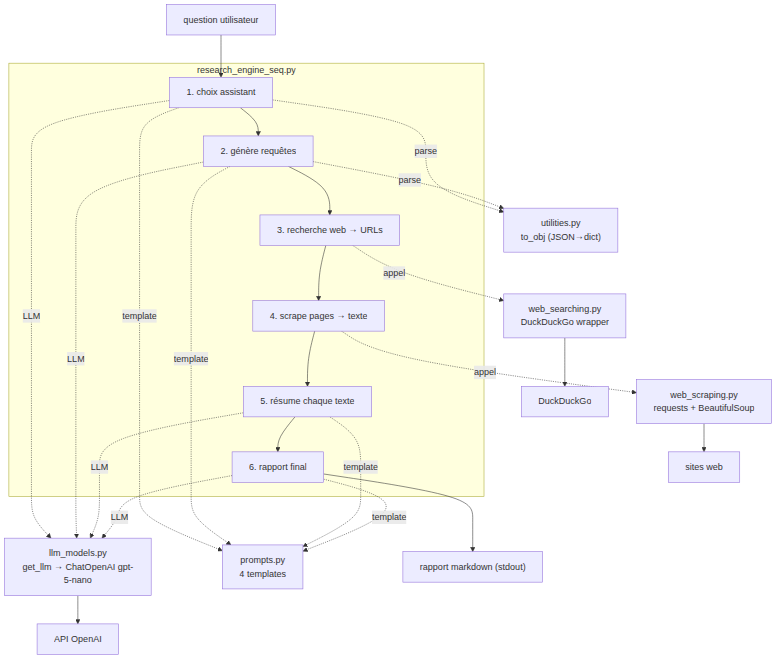

#+TITLE: Moteur de recherche séquentiel — Schéma de l'application
#+AUTHOR: Michaël CHLON
#+OPTIONS: toc:2 num:t
#+STARTUP: overview

* Vue d'ensemble

Application = pipeline LLM séquentiel piloté par =research_engine_seq.py=.
À partir d'une question utilisateur, elle produit un rapport de recherche
en 6 étapes : choix d'un assistant, génération de requêtes, recherche web,
scraping, résumé, rapport final.

* Pipeline (6 étapes)

| # | Étape           | Entrée              | Sortie              | Outils                       |
|---+-----------------+---------------------+---------------------+------------------------------|
| 1 | Choix assistant | question            | persona + instr.    | LLM + ASSISTANT_SELECTION    |
| 2 | Requêtes        | instructions        | 2 requêtes          | LLM + WEB_SEARCH             |
| 3 | Recherche web   | requêtes            | URLs (3/requête)    | web_search → DuckDuckGo      |
| 4 | Scrape          | URLs                | texte (max 10000c)  | web_scrape → requests + bs4  |
| 5 | Résumé          | texte + requête     | résumé/page         | LLM + SUMMARY                |
| 6 | Rapport         | résumés + question  | rapport markdown    | LLM + RESEARCH_REPORT        |

* Diagramme de flux

#+begin_src mermaid :file app_schema.png
flowchart TD
    Q["question utilisateur"] --> S1

    subgraph ORCH["research_engine_seq.py"]
        S1["1. choix assistant"]
        S2["2. génère requêtes"]
        S3["3. recherche web → URLs"]
        S4["4. scrape pages → texte"]
        S5["5. résume chaque texte"]
        S6["6. rapport final"]
        S1 --> S2 --> S3 --> S4 --> S5 --> S6
    end

    LLM["llm_models.py\nget_llm → ChatOpenAI gpt-5-nano"]
    P["prompts.py\n4 templates"]
    U["utilities.py\nto_obj (JSON→dict)"]
    WSE["web_searching.py\nDuckDuckGo wrapper"]
    WSC["web_scraping.py\nrequests + BeautifulSoup"]

    S1 & S2 & S5 & S6 -.LLM.-> LLM
    S1 & S2 & S5 & S6 -.template.-> P
    S1 & S2 -.parse.-> U
    S3 -.appel.-> WSE
    S4 -.appel.-> WSC

    LLM --> OAI["API OpenAI"]
    WSE --> DDG["DuckDuckGo"]
    WSC --> WEB["sites web"]

    S6 --> R["rapport markdown (stdout)"]
#+end_src

#+RESULTS:

* Diagramme ASCII (lisible sans rendu)

#+begin_example
  question
     |
     v
  [1] choix assistant ---> LLM + prompts.ASSISTANT_SELECTION + utilities.to_obj
     |
     v
  [2] requêtes recherche -> LLM + prompts.WEB_SEARCH + utilities.to_obj
     |
     v
  [3] recherche web ------> web_searching.web_search --> DuckDuckGo
     |  (URLs)
     v
  [4] scrape -------------> web_scraping.web_scrape --> requests + bs4
     |  (texte)
     v
  [5] résumé /page -------> LLM + prompts.SUMMARY
     |  (résumés)
     v
  [6] rapport final ------> LLM + prompts.RESEARCH_REPORT
     |
     v
  rapport markdown (print stdout)
#+end_example

* Modules & dépendances

| Module                   | Rôle                | Dépend de                       |
|--------------------------+---------------------+---------------------------------|
| research_engine_seq.py   | orchestre tout      | les 5 autres modules            |
| llm_models.py            | factory LLM         | langchain_openai (ChatOpenAI)   |
| prompts.py               | 4 templates prompt  | langchain_core                  |
| utilities.py             | JSON → dict         | json (stdlib)                   |
| web_searching.py         | recherche web       | langchain_community + DuckDuckGo|
| web_scraping.py          | scrape HTML         | requests + beautifulsoup4       |

* Dépendances externes

- API OpenAI (modèle =gpt-5-nano=)
- DuckDuckGo (recherche)
- Sites web cibles (scraping)
